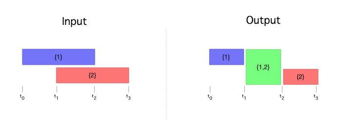

# MIEDA

**M**erging of Set-Containing **I**ntervals **E**fficiently with a **D**irected-Graph **A**lgorithm

[](https://opensource.org/licenses/Apache-2.0)
[](https://pypi.python.org/pypi/mieda/0.0.1)
[](https://travis-ci.org/vc1492a/mieda)
[](https://coveralls.io/github/vc1492a/mieda?branch=master)

MIEDA can be used to merge overlapping intervals, dependent on the intersection of sets contained within the intervals themselves. MIEDA utilizes a directed-graph 
algorithm for merging the intervals rapidly and with scalability. 



## Dependencies
- Python 3.5 - 3.8
- NetworkX >= 2.4.0

## How To

First install the package locally:

```shell
pip install . # or pip3 install ... if you're using both Python 3 and 2.
```

**Note**: The package will later be available from the Python Package Index (PyPi).

To merge intervals containing sets, pass a list of dictionaries as shown 
in the below example:

```python
import datetime
from mieda.intervals import Merge

intervals = [
    {"start": datetime.datetime(2020, 1, 1, 1, 0, 0), "finish": datetime.datetime(2020, 1, 4, 1, 0, 0),
     "set_items": {"1"}},
    {"start": datetime.datetime(2020, 1, 1, 1, 0, 0), "finish": datetime.datetime(2020, 1, 3, 1, 0, 0),
     "set_items": {"2"}}
]

print(Merge.union(intervals=intervals))
```

## Contributing
If you would like to contribute, please fork the repository and make 
any changes locally prior to submitting a pull request. 
Feel free to open an issue if you notice any erroneous behavior.

## Versioning
[Semantic versioning](http://semver.org/) is used for this project. If contributing, please conform to semantic
versioning guidelines when submitting a pull request.

## License
This project is licensed under the Apache 2.0 license.

## Research
If citing `mieda` in your research, please use the following: 

```
@article{ConstantinouMishra2020,
  doi = {},
  url = {},
  year  = {},
  month = {},
  publisher = {},
  volume = {},
  number = {},
  pages = {},
  author = {Valentino Constantinou, Asitang Mishra},
  title = {},
  journal = {}
}
```

## Tests

Tests are contained within the `tests` directory. To run tests for 
MIEDA, call pytest and pytest-cov via the command line:

```bash
python3 -m pytest --cov=mieda
```

Setting up a virtual environment for testing and development is recommended. 